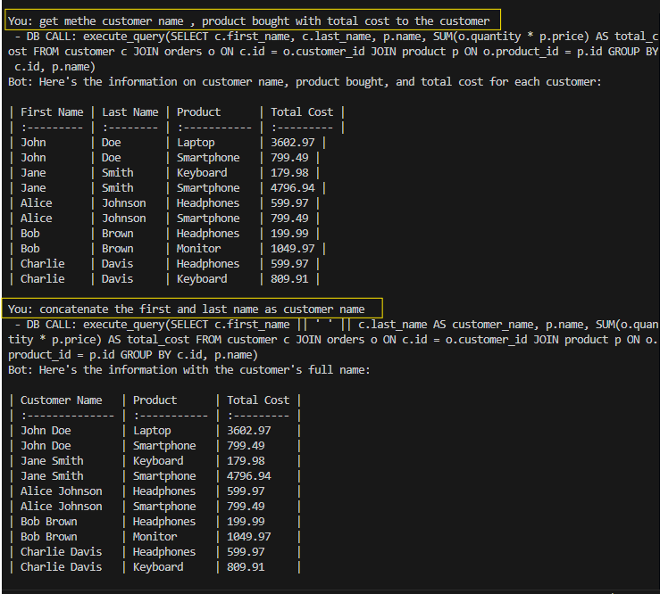
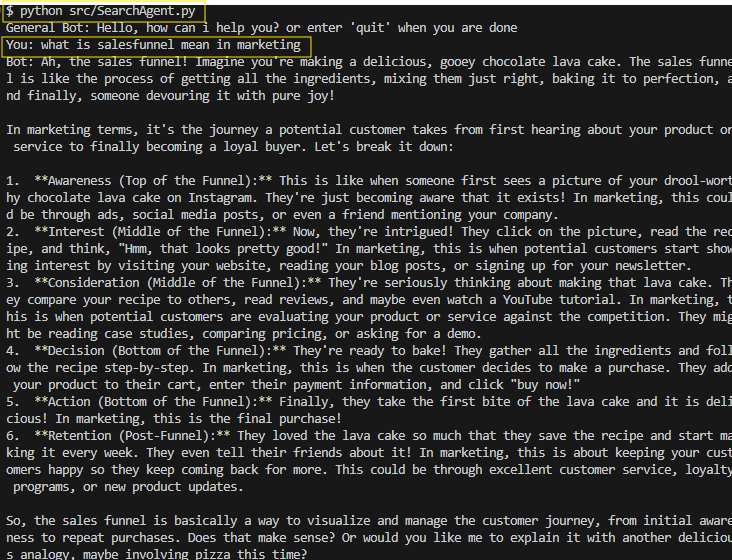

# Google Gemini SQL Agent

This project leverages the Google Gemini AI agent to execute SQL queries on an SQLite database. The application allows users to interact with the AI agent to generate SQL queries based on their input and execute them against a predefined database schema.

## Project Structure

```
google-gemini-sql-agent
├── main.py               # Entry point of the application
├── dbagent.py            # Handles database-related queries and interactions
├── searchagent.py        # Handles general search queries using Google Gemini
├── rag_app.py            # Implements Retrieval-Augmented Generation (RAG) pipeline
├── execute_schema.py     # Script to initialize the database schema and seed data
├── database              # Contains database schema and seed data
│   ├── schema.sql        # SQL statements to create tables
│   └── seed_data.sql     # Initial data for the database
├── requirements.txt      # Project dependencies
├── config                # Configuration settings
│   └── settings.py       # Application settings including API key
├── utils                 # Utility functions
│   └── query_executor.py # Function to execute SQL queries
└── README.md             # Project documentation
```

## Setup Instructions

1. **Clone the Repository**
   ```bash
   git clone https://github.com/yourusername/google-gemini-sql-agent.git
   cd google-gemini-sql-agent
   ```

2. **Install Dependencies**
   Ensure you have Python installed, then install the required packages:
   ```bash
   pip install -r requirements.txt
   ```

3. **Configure Settings**
   - Create a `.env` file in the project root and add your Google API key:
     ```
     GOOGLE_API_KEY=your_google_api_key
     ```
   - Update any additional settings in `config/settings.py` if needed.

4. **Initialize the Database**
   Run the SQL scripts to create the database schema and seed it with initial data:
   ```bash
   python execute_schema.py
   ```

5. **Run the Application**
   Start the application by running:
   ```bash
   python main.py
   ```

## Usage

- **Database Queries**: Use `dbagent.py` to interact with the SQLite database. It can list tables, describe schemas, and execute SQL queries.
- **Search Queries**: Use `searchagent.py` to handle general queries using the Google Gemini AI agent.
- **RAG Pipeline**: Use `rag_app.py` to implement a Retrieval-Augmented Generation pipeline, combining ChromaDB for retrieval and Google Gemini for generation.

## Database Schema

The application uses the following tables:

- **Product Table**: Stores information about products.
- **Customer Table**: Stores customer details.
- **Order Table**: Records customer orders.

Refer to the `database/schema.sql` file for the detailed structure of each table.

Output:
DbAgent.py


SearchAgent.py



